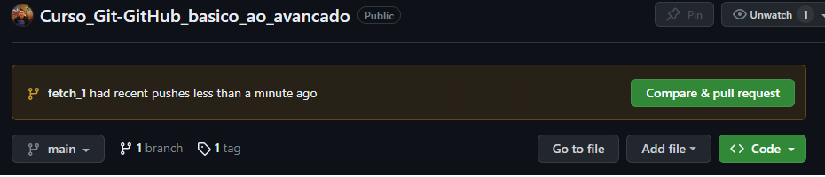
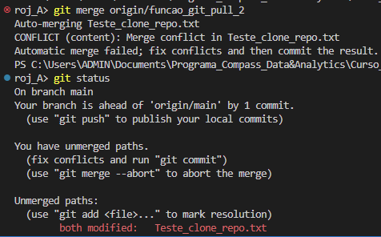

# Introdução a Branches
## O que é um branch?
● Branch é a forma que o git separa as versões dos projetos;
● Quando um projeto é criado ele inicia na branch maim, estamos
trabalhando nela até este ponto do curso;
● Geralmente cada nova feature de um projeto fica em um branch
separado;
● Após a finalização das alterações os branchs são unidos para ter o
código-fonte final;

## Criando e visualizando os branches
● Para visualizar os branchs disponíveis basta digitar git branch
● Para criar um branch você precisa utilizar o comando git branch <nome>

## Deletando branch
git branch - d ou -- delete

## Mudando de branch
git checkout -b <nome>

## Fetch
- Branches novos são criados a todo tempo e o seu git pode não estar mapeando eles;  

## Git pull
Feito alteracoes em dois branch de clones distintos, quando aplicado merge no terceiro clone, o branch deu erro. somente com o git add que o arquivo teste_clone_repo.txt ficou com os merges dos dois branchs.  Resolucao abaixo fornecida pelo git.  
  
  

## Git push (enviando alterações)  
● O comando git push faz o inverso do pull, ele envia as alterações para o repo remoto;
● Serve também para enviar as atualizações de um branch específico para um outro dev;
● Ou quando terminamos uma tarefa e precisamos enviar ao repo;